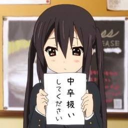
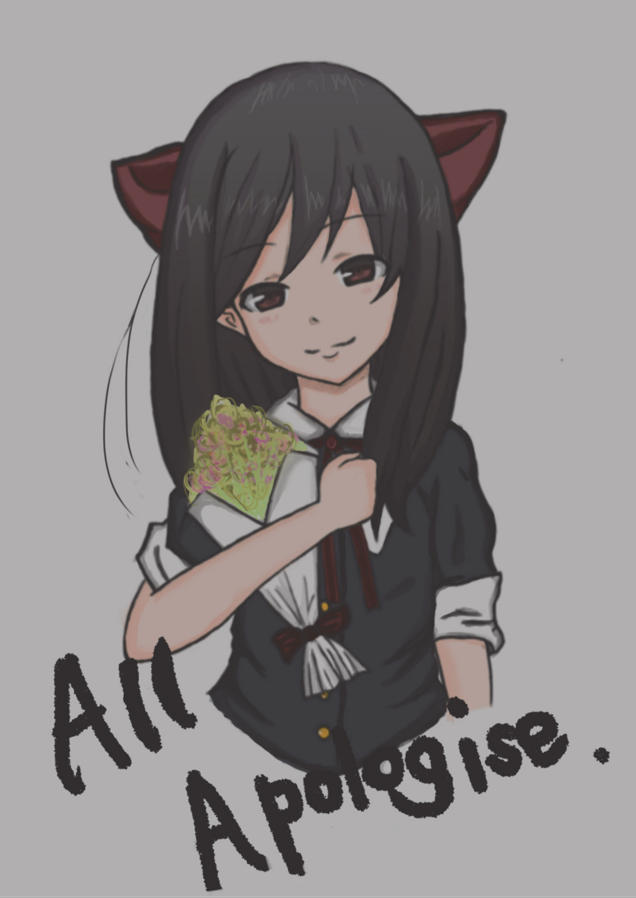

# Alice.lips

[cympfh](#/about-us)
and
[himono](#/about-us)

since 2014

# News

- 冬コミ (c89) **落選**
- Alice.lips ではかわいいふわふわした女の子を描いてくれる絵師を募集しています $\Rightarrow$ [contact](#/about-us)
- 夏コミ (c88) にて二冊公開しました $\Rightarrow$ [alice-lips/c88](https://github.com/alice-lips/c88)

# About us

Alice.lips はふわふわした可愛い女の子を主人公にした何かを作ることに命を捧げます

<i class="fa fa-twitter-square"></i>
<code>@<a href="https://twitter.com/cympfh" target="_blank">cympfh</a></code>
<i class="fa fa-github-square"></i>
<code><a href="https://github.com/cympfh" target="_blank">cympfh</a></code>
<i class="fa fa-envelope"></i>
<code>%w(cympfh gmail com).join('.').sub('.', '@')</code>

<i class="fa fa-twitter-square"></i>
<code>@<a href="https://twitter.com/minamo__i" target="_blank">minamo__i</a></code>

# History

- failed 89th comiket (2015 Winter)
- 2015/08/16: accepted at 88th comiket (2015 Summer) and published on 3rd day at `東キ03b`
- failed 87th comiket (2014 Winter)

# c88

2016/08/16

We published 2 books: "All apologies" (by himono) and "Take 3" (by cympfh).

They are published in [alice-lips/c88](https://github.com/alice-lips/c88).

